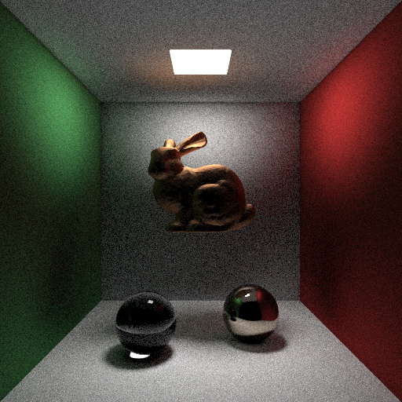
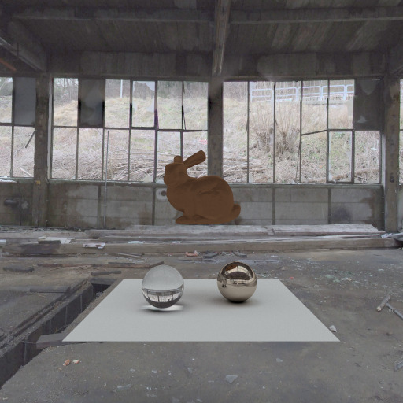

## CUDA_RayTracingAccelerate

Part1 效果演示：


Part2 效果演示：



### :computer:开发环境

- OS：ubuntu20.04
- Cuda：11.3
- GPU：RTX 2080 Ti 

### :hammer_and_wrench:如何使用

```shell
git clone https://github.com/MoYan1082/CUDA_RayTracingAccelerate.git
cd CUDA_RayTracingAccelerate/Part1
mkdir build
cmake ..
make
./main
```

渲染出来的图片路径为：`build/figure.ppm`。

### :milky_way:Features

- 物体：圆球、三角形（.obj格式模型）。
- 材质：漫反射、镜面反射、折射、光源。
- 漫反射重要性采样（Malley’s Method）。
- 加速结构：BVH（方差建树、非递归搜索）。
- 环境光贴图。
- 随机数：每个像素使用不同的随机数种子 `curand_uniform_double()`。

#### :bulb:TODO

- BRDF重要性采样。
- 纹理映射。


参考：[RayTracingTheNextWeek](http://raytracing.github.io/books/RayTracingTheNextWeek.html)，[Asixa/ALightGPU](https://github.com/Asixa/ALightGPU).

